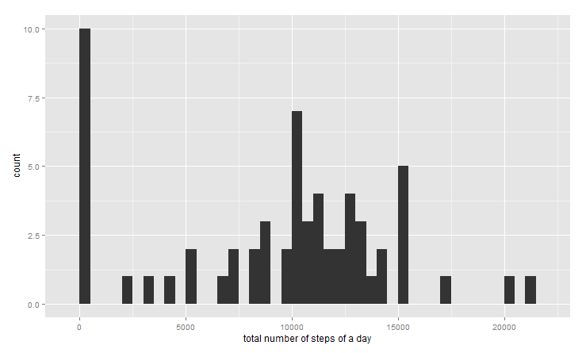

# Reproducible Research: Peer Assessment 1

## Loading and preprocessing the data

The useful packages:


```r
library(dplyr)
```

```
## 
## Attaching package: 'dplyr'
## 
## The following objects are masked from 'package:stats':
## 
##     filter, lag
## 
## The following objects are masked from 'package:base':
## 
##     intersect, setdiff, setequal, union
```

```r
library(ggplot2)
```


```r
data = read.csv("activity.csv", sep=",", head=T)
str(data)
```

```
## 'data.frame':	17568 obs. of  3 variables:
##  $ steps   : int  NA NA NA NA NA NA NA NA NA NA ...
##  $ date    : Factor w/ 61 levels "2012-10-01","2012-10-02",..: 1 1 1 1 1 1 1 1 1 1 ...
##  $ interval: int  0 5 10 15 20 25 30 35 40 45 ...
```
Convert date to Date varibale

```r
data$date =  as.Date(data$date, format="%Y-%m-%d")
str(data)
```

```
## 'data.frame':	17568 obs. of  3 variables:
##  $ steps   : int  NA NA NA NA NA NA NA NA NA NA ...
##  $ date    : Date, format: "2012-10-01" "2012-10-01" ...
##  $ interval: int  0 5 10 15 20 25 30 35 40 45 ...
```

```r
summary(data)
```

```
##      steps             date               interval     
##  Min.   :  0.00   Min.   :2012-10-01   Min.   :   0.0  
##  1st Qu.:  0.00   1st Qu.:2012-10-16   1st Qu.: 588.8  
##  Median :  0.00   Median :2012-10-31   Median :1177.5  
##  Mean   : 37.38   Mean   :2012-10-31   Mean   :1177.5  
##  3rd Qu.: 12.00   3rd Qu.:2012-11-15   3rd Qu.:1766.2  
##  Max.   :806.00   Max.   :2012-11-30   Max.   :2355.0  
##  NA's   :2304
```

## What is mean total number of steps taken per day
Calculate the total number of steps taken per day


```r
step.total=tapply(data$steps, data$date, sum, na.rm=T)
```

Make a histogram of the total number of steps taken each day


```r
qplot(step.total, binwidth=500, xlab="total number of steps of a day")
```

 


Calculate and report the mean and median of the total number of steps taken per day


```r
mean(step.total)
```

```
## [1] 9354.23
```

```r
median(step.total)
```

```
## [1] 10395
```

## What is the average daily activity pattern?


```r
step.average=aggregate(x=list(steps=data$steps), by=list(interval = data$interval), mean, na.rm=T)
#plot(step.average, type="l", xlab="Time interval", ylab= "Average number of steps")
ggplot(step.average, aes(x=interval,y=steps)) + geom_line(colour="blue") + xlab("Time interval") + ylab ("Average number of steps")
```

 

Which 5-minute interval, on average across all the days in the dataset, contains the maximum number of steps?


```r
which(step.average$steps ==max(step.average$steps))
```

```
## [1] 104
```

## Imputing missing values

Calculate and report the total number of missing values in the dataset (i.e. the total number of rows with NAs)


```r
total.na = is.na(data$steps)
table(total.na)
```

```
## total.na
## FALSE  TRUE 
## 15264  2304
```

The mean for that 5-minute interval for filling in all of the missing values in the dataset. 


```r
for(i in 1: nrow(data)){
        if (is.na(data$steps[i])){
               j =i %% 288  
                if (j != 0){
                        data$steps[i] = step.average$steps[i %% 288 ] 
                       # print(step.average$steps[i] )
                }else{
                        data$steps[i] = step.average$steps[288]   
                }
               
        } 
}
table(is.na(data$steps))
```

```
## 
## FALSE 
## 17568
```

Create a new dataset that is equal to the original dataset but with the missing data filled in.


```r
data.new= data.frame(data$steps, data[,2],data[,3])
colnames(data.new) = colnames(data)
total.date=tapply(data.new$steps, data.new$date, sum, na.rm=T)
qplot(total.date, binwidth=500, xlab="total number of steps of a day")
```

 


```r
mean(total.date)
```

```
## [1] 10766.19
```

```r
median(total.date)
```

```
## [1] 10766.19
```

## Are there differences in activity patterns between weekdays and weekends?

Convert date to as.Date

```r
data.new$date = as.Date(data.new$date, format= "%Y-%m-%d")
data.new$day = rep("0", nrow(data.new))
for (i in 1 : nrow(data.new)){
        week.day = c("Monday","Tuesday","Wednesday","Thursday","Friday")
        if(weekdays(data.new$date[i]) %in% week.day == T){
                 data.new$day[i] = "weekday"
        }else{
                data.new$day[i] = "weekend"
        }
}
```


```r
average.new= aggregate(steps ~ interval + day, data=data.new, mean)
ggplot(average.new, aes(x=interval, y= steps)) + geom_line() + facet_grid(day~.)+xlab("5-minute interval") + ylab("Number of steps")
```

 


